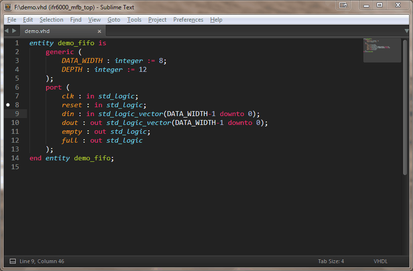

# VHDL Mode

## Overview

This package attempts to recreate the functionality found in the well-loved language mode in Emacs.  The extensibility of Sublime Text makes it an excellent platform upon which to attempt this.

This package may stand alone, however it was created to co-exist peacefully along with the Emacs Pro Essential package.  In that same vein, the keyboard shortcuts were designed around the vhdl-mode shortcuts in Emacs.  Additionally, there is now a Preferences setting that activates the Emacs vhdl-mode keybinds if desired.

Initially, the package relied upon the TextMate syntax file by Brian Padalino (after conversion to the ST3 YAML format).  However after working with this syntax definition, it became apparent that this syntax definition did not conform well to current scoping best practices (noticable with color schemes) and had some issues with certain syntactical structures.  An effort was undertaken to rewrite the syntax file from the language reference and incorporate meaningful and fine grained lexical scopes.

If any bugs are found or feature requests are desired, please visit either:

* [Project Issues (at github.com)](https://github.com/Remillard/VHDL-Mode/issues "VHDL Mode Issue Tracker")
* [VHDL Mode Package Announcement (at Sublime Text Forum)](https://forum.sublimetext.com/t/vhdl-mode-for-sublime-text-3/29782 "VHDL Mode Announcement")

I will state up front that I cannot duplicate Emacs vhdl-mode perfectly (e.g. see the discussion on stutter typing).  However if there is a particular omission or a feature that is desireable, please feel free to open an issue.  I'm happy to investigate and attempt implementation.

## Feature Set

* Syntax file supporting highly granular scoping of lexical structures.  VHDL-2008 is supported pretty well.  VHDL-2019 is not yet supported.
* Port copying from entity or component declarations.
	* May be pasted as entity, component, signals, direct entity instantiations, or testbench.
	* Ports may be flattened or reversed.
	* Instantiation insertion is 'smart' in that it will not duplicate an already existing instantiation name.
	* Accessible via keybind or right click context menu.
* Subprogram coping from a declaration or specification.
	* May be pasted as a declaration, body, or call.
	* Parameters may be flattened.
	* Accessible via keybind or right click context menu.
* Stutter typing shortcuts for the assignment operators and commenting structures.
* Templates in the form of snippets for commonly used structures.
	* Header template is further customizable through settings and will update a time field on save.
* Code beautification supporting several parenthetical code styles natively (Kernigan & Ritchie, Allman, and Lisp)
* Sublime Text **Goto** symbol and definition support, both local and global for source tree navigation.
* Region comment/uncommenting.  Also handles the continuous commenting behavior of Emacs vhdl-mode.  While writing a comment line, if the final character before hitting `Enter` is a space, the next line will also be a comment, with the commenting characters automatically inserted.

## Related Packages

* [Emacs Pro Essentials](https://packagecontrol.io/packages/Emacs%20Pro%20Essentials) by sublime-emacs : The VHDL Mode package will work without this package, however if you are coming from Emacs vhdl-mode, you may find this package useful.  Also see the setting for turning on Emacs vhdl-mode keybinds.
* [HDLProject](https://packagecontrol.io/packages/HDLProject) by bootsiaz : It's the closest thing to Emacs vhdl-mode Speedbar that I know of.  This clever implementation leverages symbolic links to make use of Sublime Text's Sidebar for hierarchical project display.

## Dependencies

* ruamel.yaml : This will be installed by Package Control automatically as part of installing the package if it is not already present.

## Future Design Goals

* Improved scoping and any feature that seems reasonable.

# Usage

## Configuration

The VHDL Mode `sublime-settings` file contains fields that are used to fill in certain fields in the header template upon insertion.  A user override may be created by selecting `Preferences` >> `Package Settings` >> `VHDL Mode` >> `Settings`.  This will bring up the default settings file and a User variation on the settings.  To customize the fields, simply copy and paste the defaults over to the User override file, and edit to taste.

These fields can also be set in the `sublime-project` file under `"settings"` for project specific behavior.  To facilitate this, a project helper snippet was created to inject these settings when editing the project file.  Simply select `Project` >> `Edit Project` from the menu, move the cursor past the `"folders"` line and type `project` and hit `Tab` for the snippet completion.  The project snippet also creates a couple of sample build methods that can be used for the project.

One particular setting meshes with both the header template and the on-save time field.  The `vhdl-modified-time-string` setting is the string that the code looks for when catching the on-save event, and updating that field.  This should only be altered if the header snippet has been modified.  When the event triggers, the code searches for that string, and replaces that line with the string, plus the time information.

Code beautification should pay attention to the `tab_size` and `translate_tabs_to_spaces` settings that are part of the standard Sublime Text preferences.  Please let me know if this causes any issues.

* `vhdl-user` : *String* : Fills in the username portion of the header template.
* `vhdl-company` : *String* : Fills in the company name portion of the header template.
* `vhdl-project-name` : *String* : Fills in the project name portion of the header template.  This one is a good candidate for customizing in the `sublime-project` file!
* `vhdl-platform` : *String* : Fills in the platform or part number portion of the header template.
* `vhdl-standard` : *String* : Fills in the coding standard portion of the header template.
* `vhdl-line-length` : *Integer* : This value is used for determining the length of line for comment "lines" generated.  Defaults to 80 characters.
* `vhdl-modified-time-string` : *String* : Represents the string that will be searched for when the file is saved.  If this is found, that line is replaced with a string comprising of this pattern, plus the current time.  This is also used in the header creation to make sure that header template insertion injects the correct string.
* `vhdl-use-copyright-block` : *Boolean* : Setting this to true will make the header template insertion inject the copyright block.  Setting this to false will make it such that this section is not used.
* `vhdl-copyright-block` : *String List* : This list of strings will be joined by newlines and prepended by a newline (required due to the optional nature of this block -- see the snippet field location) and is used when `vhdl-use-copyright-block` is set to true.  This string will be searched for `${YEAR}` and `${COMPANY}` and replaced by the current year, and the `vhdl-company` string respectively.  The string list is required since JSON does not allow multiline strings.  This block now also supports `${LINE}` to generate a line matching the `vhdl-line-length` parameter.
* `vhdl-use-revision-block` : *Boolean* : Setting this to true will make the header template insertion inject the revision block.  Setting this to false will make it such that this section is not used.
* `vhdl-revision-block` : *String List* : This list of strings will be joined by newlines and prepended by a newline.  It is used when `vhdl-use-revision-block` is set to true.  This block now also supports `${LINE}` to generate a line matching the `vhdl-line-length` parameter.
* `vhdl-emacs-keybinds` : *Boolean* : This setting must be set in the User's Preferences, and not the VHDL Mode package settings.  When set `true` this activates a second set of keybindings that are identical to the Emacs vhdl-mode keybindings.  ***WARNING!!! This should NOT be used unless the user is using Emacs Pro Essentials and is familiar with Emacs keybindings.  The trigger key for most Emacs code functions starts with `C-c` which is really going to mess with your head if you're expecting that to be the typical Windows Copy command.***

## Key Mappings

As mentioned, the goal here was to be familiar with Emacs vhdl-mode users.  However I am well aware that I'm also in a Windows environment, and the commonly used `C-c` prefix for code mode commands in Emacs will conflict with the standard Windows copy command.  Sublime Text 3 frequently uses `M-k` as an extension keymap and this seemed a suitable replacement (in the Windows environment the `Meta` key is `Alt`).  The key mappings are also context selected, so should not trigger on anything that is not a `source.vhdl` file.

Another note, these are sequence keystrokes.  For example to copy a port interface from an entity, move the point into the structure (anywhere should be fine) and hit `Alt-k` then `p` then `w`.  These should not be chorded.

For the long-time Emacs vhdl-mode user, there is now a preference for activating the original Emacs vhdl-mode keybinds.  I am not going to document these here as it will likely confuse new users however if interested, simply look at the `Default (Windows|OSX|Linux).sublime-keymap` file for the keybinds.

**Port Interface Copy/Paste Functions**

It may help to remember `p` for port, then `w` for write (to buffer).  The other mnemonics are fairly straightforward.  These commands are also available with the right-click context menu under the `VHDL Mode` heading.

* Copy Ports : `M-k p w`
* Paste as Signals : `M-k p s`
* Paste as Component: `M-k p c`
* Paste as Entity: `M-k p e`
* Paste as (Direct Entity) Instance: `M-k p i`
* Paste as Testbench: `M-k p t` -- Opens a new view and fills out boilerplate material with the interface as the unit under test.
* Flatten ports: `M-k p f` -- An interface clause with multiple names on one line is flattened into one name per line.
* Reverse ports: `M-k p r` -- The direction of ports is reversed: `in` become `out`, and `out` or `buffer` becomes `in`.

The following animated GIF demonstrates a portion of the port copying feature.

**Subprogram Interface Copy/Paste Functions**

It may help to remember `s` for subprogram, then `w` for write (to buffer).  Much like the port version of this feature, the mnemonics are straightforward.  These commands are also available with the right-click context menu under the `VHDL Mode` heading.

* Copy Subprogram : `M-k s w`
* Paste as Declaration : `M-k s d`
* Paste as Body : `M-k s b`
* Paste as Call : `M-k s c`
* Flatten parameters: `M-k s f` -- An interface clause with multiple names on one line is flattened into one name per line.

**Commenting**

It may help to remember 'c' for code, then 'c' for comment, 'b' for beautify, etc.  These commands are also available with the right-click context menu under the `VHDL Mode` heading.

* Toggle Comment Region : `M-k c c`
* Beautify Entire Buffer : `M-k c b`

**Template**

Largely templating is handled by the snippet system, however the header is a special feature as it inserts various fields automatically.  Remember 't' for template and 'h' for header.  These commands are also available with the right-click context menu under the `VHDL Mode` heading.

* Insert Header : `M-k t h`

**Miscellaneous**

* Package Version : `M-k v`
* Scope at Point : `M-k S`
* Build : `C-c C-k` -- Only if `vhdl-emacs-keybinds` is set to true.  Otherwise the Sublime Text 3 default keybind of `F7` will run build.
* Auto matching double quotes : Additional source specific variation on this keybind to permit leading characters (oOxX) for VHDL octal and hexadecimal literals.

## Stutter Typing

In Emacs vhdl-mode, double striking some keys will insert some syntactical punctuation elements.  Unfortunately, I cannot duplicate the entire Emacs vhdl-mode stutter typing repetoire since I do not have access to the keystream directly.  What I have been able to do is use keybindings and in one case a keybinding plus a macro to replicate the behavior.  I'll list the implemented replacements and then a note on the ones I cannot and why I cannot replicate these.  The symbols below will have a space on either side of them which is difficult to see in this HTML documentation.

* `;;` : Produces ` : `
* `;;;` : Produces ` := ` (See notes below)
* `..` : Produces ` => `
* `,,` : Produces ` <= `
* `---` : Produces a comment line extending to the column set by the `vhdl-line-length` setting (default: 80) starting where the cursor is, and accounting for tabs.  This one pays attention to the `tab_size` Preference if you use tabs.  If the cursor is beyond the defined line length, the line will simply be a two character comment `--` and produce a warning in the console.
* `--=` : Produces a three-sided comment box extending to the column set by the `vhdl-line-length` setting (default: 80) starting where the cursor is, and accounting for tabs.  If the cursor is beyond the defined line length, the box will simply be bounded by `--` above and below (not a "line"), and a warning will be produced in the console.  (See notes on variation from the original Emacs vhdl-mode `----` box.)

The following are the stutter typing replacements I cannot do.

* `[`, `[[`, `]`, `]]` : These cannot be duplicated properly.  The problem is that the Sublime API does not have direct access to the keystream.  The only way to replicate this (as I was able to with `;;;`) is to create a keybind that checks the preceding text and if it is the replaced text, execute a macro that deletes and replaces the text with the new text.  However if I replaced `[` with `(` and then looked for a preceding paren for `[[` then one would never be able to properly type nested parenthesis.
* `''` : This interferes with the auto-completion feature in Sublime Text so I have opted to not implement it.
* `;;;` : I'd like to give fair warning that this is not implemented exactly like Emacs does it.  How this works is that `;;` creates ` : `.  I have also keybound `;` to check for the preceding text and if it is ` : ` then it will execute a macro that deletes and replaces with ` := `.  The side effect of this is that if the cursor is placed at a point in the text where ` : ` is just behind the point, this macro will ALSO execute then.  I think this is likely a fairly rare event and I have no other way to create this behavior, so I opted for this workaround.
* `----` : Again I cannot duplicate this by checking the prior text because that would create issues if someone was just trying to make a custom length comment dash line.  I created the `--=` as a replacement for the comment box.
* `==` : Honestly I could create this one however it's kind of pointless.  The `==` is not a VHDL operator and I'm not honestly certain why it's in Emacs vhdl-mode.

## Snippets

Most snippets will execute from the keyword associated with them (i.e. 'entity' will fill out the beginning and ending structures and leave the cursor in the middle.)  Each of these snippet words require hitting Tab afterwards to execute.  This is just a list of the less obvious shortcuts.  A full list of the snippets implemented may be found by selecting the `Tools` >> `Snippets` menu.

* `spro` : Synchronous Process
* `cpro` : Combinatorial Process
* `funcd` : Produces a function specification/declaration
* `funcb` : Produces a function with body.
* `procd` : Produces a procedure specification/declaration
* `procb` : Produces a procedure with body.
* `genmap` : Produces a generic map association list, differentiated from a generic interface list.
* `portmap` : Produces a port map association list, differentiated from a port interface list.
* `project` : Active while editing a Sublime Text project file.  Fills in local copies of the setting keys and instantiates a couple of example build systems.
* And others... again please see the Snippets directory or the `Tools` >> `Snippets` menu for the complete list.

## Miscellaneous Features

* The insert header command uses several fields from the package settings.  Please see above in **Configuration** for a list of the fields and types to edit to customize the header insertion.
* The on-save event is trapped and will do a scan of the file, and by default look for `-- Last update : ` in a VHDL file.  If it finds this structure it will update the time and date on that line automatically (it removes that lines and replaces it).  This pattern is configured through settings.
* Most commands (save for snippets) will leave a trace in the ST3 console which may be useful for debugging.  Any package message specific to this package will start with `vhdl-mode:`

## Known Issues and Design Commentary

* This is a work in progress however I've been eating my own dog food and it works fairly satisfactorily for me currently.  I've thrown several code styles and files from other authors at it and tried to iron out the stranger bugs.  However there are a lot of coding styles and I do not promise that the beautifier will work with every one of them.  If there is an issue with a particular structure, I'm happy to get a sample and see if I can make it work.
* The TextMate VHDL syntax supported non-matching identifiers in several locations.  In order to get greater scope granularity, I had to sacrifice that feature in a few constructs because match captures do not persist through syntax scope set commands.  More work can be done in identifying illegal identifiers in various locations however.
* The syntax file was written with reference to the language definition in _Designer's Guide to VHDL, 3rd Edition_ by Peter Ashenden.  The language definition reference is in Appendix B, and library reference taken from Appendix A.  Knowing how the language is structured may help understanding the syntax file and why it's done the way it is.
* Designed to work with Sublime Text 3.  It is unlikely to work with Sublime Text 2 (that is to say, I would be delighted if it did, however I have never used ST2 nor tested against it so your mileage may vary.)
* I wrote my own comment routine for the region.  This may not work the same way as ST3's own comment/uncommenter.  I tried to keep the vhdl-mode behavior where it will region indent everything at the same column.
* I have not tested this on Linux or Mac so I cannot tell how well it may work, or not, as the case may be.  I would love to find out if there are any issues and happy to attempt to resolve them.
* I did not create a snippet for everything under the sun.  In vhdl-mode, the templates were one of my least used features.  Generally I like the templates to cover large scale things that save a lot of typing.  That is to say, there's no real need in my mind for every single keyword to have its own snippet.  That being said, other packages have some of those things, and Sublime Text 3's snippet creation capability is simple, easy-to-use, and quite customizable.  If anyone creates one they believe flows naturally from regular coding I'd be happy to evaluate it and include it with attribution.
* There's no particularly graceful way to handle vhdl-mode's prompting for fields, for example, when creating an entity.  Thus, some of these behaviors were broken up into several snippets.  Typing `entity <Tab>` will form the starting and stopping entity structure, then place the cursor in the middle.  Typing `port <Tab>` at this point will start a port interface list.  In this way the flavor of the templating is retained but within a ST3 model.  If I can find a way to handle a full prompt construction, I will try to implement it, but for now it's limited to snippet support.

# Contributors

This is a new section and I wanted to acknowledge and thank folks who have helped out with fixes and testing.  If anyone else has fixes or contributions, please feel free to open an issue at the Github repository and we can discuss it.  If submitting a pull-request, please target the develop branch, as I keep the master branch for releases only.

* Sven Goossens (Github: @Sv3n)
* Stefan Lippuner (Github: @stefanlippuner)

# Conclusion

I hope you find this Sublime Text package useful for coding in VHDL.  The language is a passion of mine and it has been a great experience extending Sublime Text to work with it.

This package is offered with no warranty and no liability.  It's free to use and distribute with any code, however I would appreciate attribution for my work if forking, modifying, or incorporating.  Happy to work with other Sublime Text package authors as well.

MIT License

Copyright (c) 2017 Mark Norton

Permission is hereby granted, free of charge, to any person obtaining a copy of this software and associated documentation files (the "Software"), to deal in the Software without restriction, including without limitation the rights to use, copy, modify, merge, publish, distribute, sublicense, and/or sell copies of the Software, and to permit persons to whom the Software is furnished to do so, subject to the following conditions:

The above copyright notice and this permission notice shall be included in all copies or substantial portions of the Software.

THE SOFTWARE IS PROVIDED "AS IS", WITHOUT WARRANTY OF ANY KIND, EXPRESS OR IMPLIED, INCLUDING BUT NOT LIMITED TO THE WARRANTIES OF MERCHANTABILITY, FITNESS FOR A PARTICULAR PURPOSE AND NONINFRINGEMENT. IN NO EVENT SHALL THE AUTHORS OR COPYRIGHT HOLDERS BE LIABLE FOR ANY CLAIM, DAMAGES OR OTHER LIABILITY, WHETHER IN AN ACTION OF CONTRACT, TORT OR OTHERWISE, ARISING FROM, OUT OF OR IN CONNECTION WITH THE SOFTWARE OR THE USE OR OTHER DEALINGS IN THE SOFTWARE.
